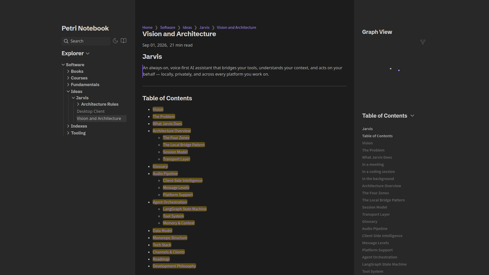
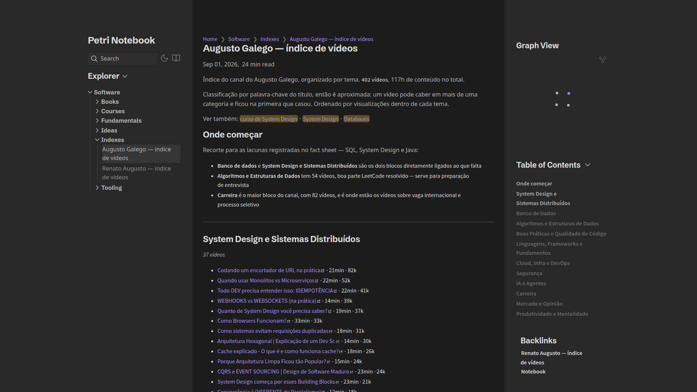

<h1 align="center">📓 notebook</h1>

<br>

<h3 align="center">My Obsidian vault, published.<br>Book summaries, course notes and software fundamentals</h3>

<p align="center">
  <a href="https://notebook.petri.zip"></a> <a href="https://github.com/Petri-Hub/notebook/actions/workflows/deploy.yml"></a> <a href="https://github.com/Petri-Hub/notebook/commits/main"></a>
</p>

<br>

## About

> **TL;DR:** a public mirror of my Obsidian vault — notes on software engineering, written while reading, watching or building something. Nothing here is a tutorial: notes are dense, opinionated, and rewritten whenever I understand a topic better.

<table>
  <tr>
    <td width="50%"><a href="https://notebook.petri.zip/software/ideas/jarvis/vision-and-architecture"></a></td>
    <td width="50%"><a href="https://notebook.petri.zip/software/indexes/augusto-galego"></a></td>
  </tr>
</table>

## What's inside

```sh
├── Books         # chapter-by-chapter notes on technical books
├── Courses       # notes taken while following a course
├── Fundamentals  # core concepts, studied on their own rather than from one source
├── Ideas         # plans and architecture for side projects
├── Indexes       # video channels, catalogued by topic
└── Tooling       # notes on specific tools, still being written
```

## Technologies

<table align="center">
  <tr>
    <td align="center" width="96"><br>Obsidian</td>
    <td align="center" width="96"><br>Markdown</td>
    <td align="center" width="96"><br>Quartz</td>
    <td align="center" width="96"><br>GitHub Actions</td>
    <td align="center" width="96"><br>GitHub Pages</td>
  </tr>
</table>

## Reading

The notes are easier to read on the website, with search, backlinks and the graph view: [notebook.petri.zip](https://notebook.petri.zip).
